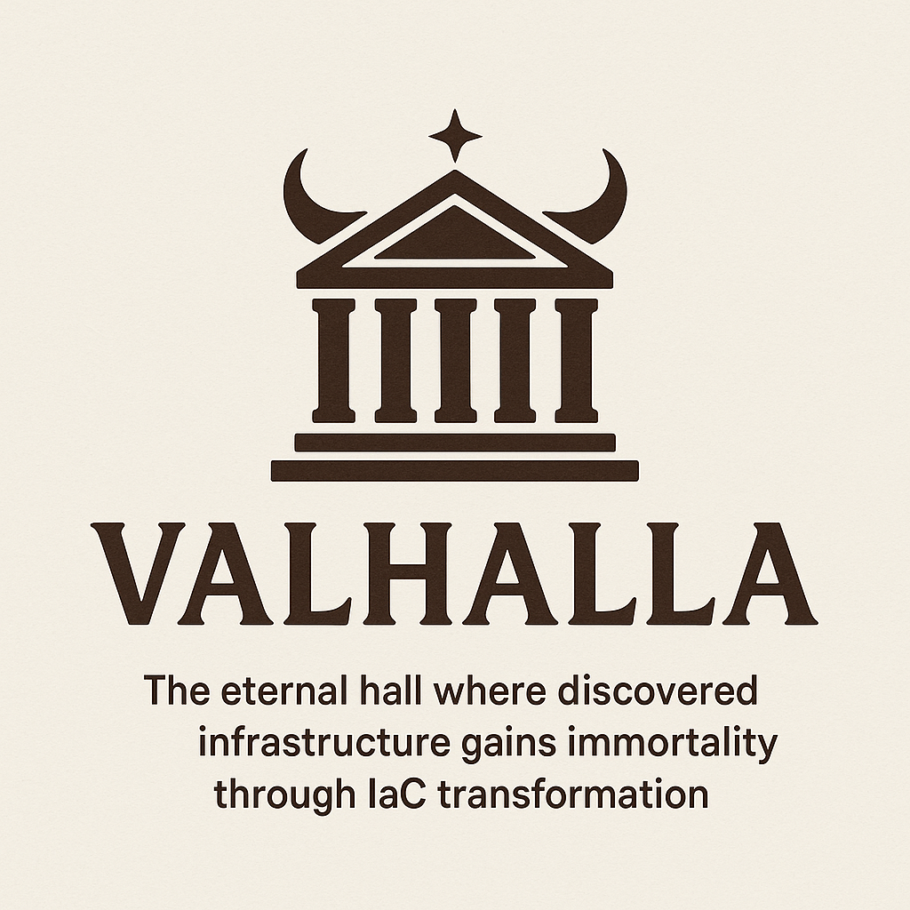

# Valhalla

<div align="center">
  
  
  **Hypervisor Infrastructure Discovery and IaC Generation Tool**
  
  *The eternal hall where discovered infrastructure gains immortality through IaC transformation*
</div>

<div align="center">

[](https://golang.org/dl/)
[]()
[]()
[](LICENSE)

</div>

## ⚡ What Valhalla Does

Valhalla bridges the gap between existing hypervisor infrastructure and modern Infrastructure as Code practices. While cloud-native IaC tools are abundant, the virtualization world has been left behind. Valhalla changes that.

- **🔍 Discover Hypervisor Infrastructure** - Connect to VMware vSphere and KVM environments to catalog existing resources
- **⚔️ Transform to IaC Warriors** - Convert discovered VMs, networks, and storage into battle-tested Infrastructure as Code
- **🏰 Eternal Code Halls** - Generate Terraform, Pulumi, and native templates that ensure your infrastructure lives forever
- **🌉 Bridge Worlds** - Seamlessly move from manual VM management to automated IaC workflows

## 🎯 Why Valhalla Exists

**The Problem**: Organizations running VMware vSphere and KVM infrastructure are stuck in manual provisioning cycles while their cloud-native counterparts enjoy the benefits of Infrastructure as Code. Existing tools like Terraformer focus on cloud providers, leaving hypervisor environments behind.

**The Solution**: Valhalla specifically targets hypervisor infrastructure discovery and IaC generation, filling the critical gap for organizations managing on-premises and hybrid virtualization environments.

## 🏗️ Architecture Overview

Valhalla follows a modular, extensible architecture designed for enterprise hypervisor environments:

```
┌─────────────────────────────────────────────────────────────────┐
│                      Valhalla Core                              │
├─────────────────────────────────────────────────────────────────┤
│  Discovery Engine    │  Transformation Engine   │  Output       │
│  ┌─────────────────┐ │  ┌─────────────────────┐ │  Engine       │
│  │ vSphere Client  │ │  │ Resource Mapper     │ │  ┌──────────┐ │
│  │ KVM/Libvirt     │ │  │ Dependency Analyzer │ │  │Terraform │ │
│  │ API Connectors  │ │  │ Template Generator  │ │  │Pulumi    │ │
│  └─────────────────┘ │  └─────────────────────┘ │  │Native    │ │
│                      │                          │  └──────────┘ │
└─────────────────────────────────────────────────────────────────┘
```

## 🚀 Supported Platforms

### VMware vSphere
- **Virtual Machines** - CPU, memory, storage, network configurations
- **Virtual Networks** - Port groups, VLANs, distributed switches
- **Storage** - Datastores, virtual disks, storage policies
- **Resource Pools** - CPU/memory allocation and limits
- **vApps** - Application containers and dependencies

### KVM/Libvirt
- **Domains (VMs)** - Guest configurations and resource allocation
- **Networks** - Virtual networks, bridges, and NAT configurations
- **Storage Pools** - Storage backends and volume management
- **Node Resources** - Host CPU, memory, and storage capacity

## 🛠️ IaC Output Formats

- **Terraform (.tf)** - HCL format with provider-specific resources
- **Pulumi** - Multi-language support (Python, TypeScript, Go, C#)
- **VMware vSphere Terraform Provider** - Native vSphere resources
- **Libvirt Terraform Provider** - Native KVM/libvirt resources
- **Custom Templates** - Organization-specific IaC patterns

## 📋 Roadmap

### 🎯 Phase 1: Foundation (In Progress)
- [ ] Core architecture and CLI framework
- [ ] VMware vSphere API connector
- [ ] Basic VM discovery and cataloging
- [ ] Simple Terraform template generation
- [ ] Configuration management system

### 🎯 Phase 2: KVM Integration
- [ ] Libvirt API connector
- [ ] KVM domain discovery
- [ ] Network and storage discovery
- [ ] Multi-hypervisor orchestration
- [ ] Cross-platform resource mapping

### 🎯 Phase 3: Advanced IaC Generation
- [ ] Dependency analysis and ordering
- [ ] Resource relationship mapping
- [ ] Pulumi program generation
- [ ] Custom template engine
- [ ] Validation and testing framework

### 🎯 Phase 4: Enterprise Features
- [ ] Bulk infrastructure migration tools
- [ ] Change detection and drift analysis
- [ ] Integration with CI/CD pipelines
- [ ] RBAC and multi-tenancy support
- [ ] Disaster recovery template generation

## 🚀 Quick Start

### Prerequisites

- Go 1.21 or higher
- VMware vSphere environment (for vSphere discovery)
- KVM/libvirt environment (for KVM discovery)
- Terraform installed (for template validation)

### Installation

```bash
# Clone the repository
git clone https://github.com/BigChiefRick/valhalla.git
cd valhalla

# Build the project
make build

# Verify installation
./bin/valhalla --help
```

### Basic Usage

```bash
# Discover VMware vSphere infrastructure
valhalla discover --provider vsphere \
  --vcenter vcenter.example.com \
  --username admin \
  --datacenter "Production DC" \
  --format table

# Generate Terraform templates
valhalla generate --provider vsphere \
  --input discovery-results.json \
  --output terraform \
  --output-dir ./infrastructure

# Discover KVM infrastructure
valhalla discover --provider kvm \
  --libvirt-uri qemu+ssh://user@kvm-host/system \
  --format json

# Multi-hypervisor discovery
valhalla discover \
  --provider vsphere --vcenter vcenter.example.com \
  --provider kvm --libvirt-uri qemu+ssh://user@kvm-host/system \
  --output multi-hypervisor.json
```

## 🔐 Authentication

### VMware vSphere
```bash
# Interactive authentication
valhalla auth vsphere --vcenter vcenter.example.com

# Environment variables
export VSPHERE_USER="admin@vsphere.local"
export VSPHERE_PASSWORD="password"
export VSPHERE_SERVER="vcenter.example.com"

# Configuration file
echo "vsphere:
  server: vcenter.example.com
  username: admin@vsphere.local
  insecure: true" > ~/.valhalla.yaml
```

### KVM/Libvirt
```bash
# SSH-based connection
valhalla discover --provider kvm \
  --libvirt-uri qemu+ssh://user@kvm-host/system

# Local libvirt
valhalla discover --provider kvm \
  --libvirt-uri qemu:///system

# TLS connection
valhalla discover --provider kvm \
  --libvirt-uri qemu+tls://kvm-host/system
```

## 🤝 Contributing

Valhalla is built for the hypervisor community, by the hypervisor community. We welcome contributions from infrastructure engineers, DevOps practitioners, and anyone working with virtualization technology.

### Development Setup

1. Fork the repository
2. Create a feature branch: `git checkout -b feature/your-feature`
3. Make your changes and test: `make test`
4. Commit: `git commit -am "Add your feature"`
5. Push: `git push origin feature/your-feature`
6. Create a Pull Request

### Areas of Contribution

- **Hypervisor Connectors** - Additional virtualization platform support
- **IaC Generators** - New template formats and patterns
- **Resource Discovery** - Enhanced resource type coverage
- **Testing** - Integration tests with real hypervisor environments
- **Documentation** - User guides and API documentation

## 📄 License

This project is licensed under the [MIT License](LICENSE) - see the LICENSE file for details.

## 🛡️ Security

Please report security vulnerabilities through GitHub Security Advisories or email the maintainers directly.

## 📞 Support

- **📚 Documentation**: [Wiki](https://github.com/BigChiefRick/valhalla/wiki)
- **🐛 Issues**: [GitHub Issues](https://github.com/BigChiefRick/valhalla/issues)
- **💬 Discussions**: [GitHub Discussions](https://github.com/BigChiefRick/valhalla/discussions)
- **💼 Enterprise Support**: Contact the maintainers for commercial support options

---

<div align="center">

**⚔️ Join the Hall of Heroes ⚔️**

*Where infrastructure warriors earn eternal life through code*

*Built with ❤️ for the hypervisor community*

</div>
